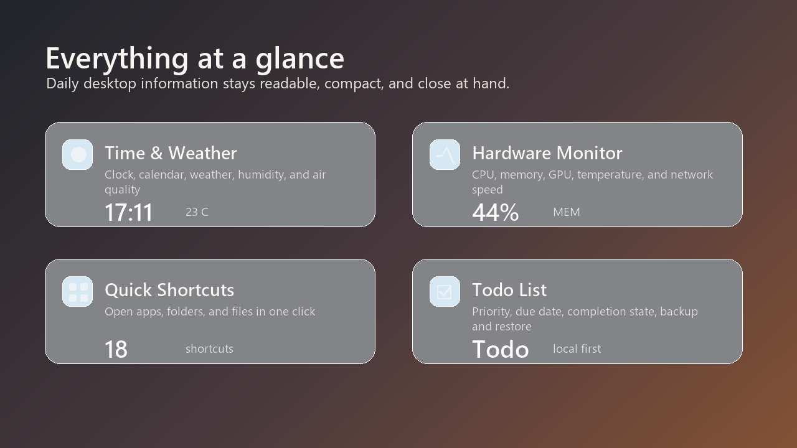
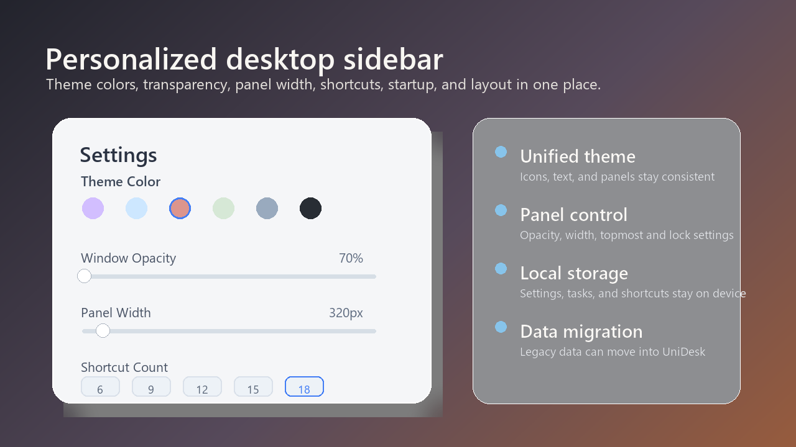

# UniDesk

<p align="center">
  
</p>

<p align="center">
  <b>A lightweight Windows desktop sidebar for time, weather, hardware status, shortcuts, and todos.</b>
</p>

<p align="center">
  <a href="#features">Features</a> ·
  <a href="#screenshots">Screenshots</a> ·
  <a href="#hardware-monitor">Hardware Monitor</a> ·
  <a href="#install">Install</a> ·
  <a href="#build">Build</a>
</p>

UniDesk is a compact personal desktop hub for Windows. It stays on the edge of your desktop and keeps daily information, quick actions, and lightweight system status in one themeable panel.

## Features

- **Time & Weather**: clock, date, lunar date, weather, humidity, air quality, and temperature range.
- **Hardware Monitor**: CPU, memory, GPU, temperature, and real-time network RX/TX speed.
- **Quick Shortcuts**: pin apps, folders, and files for one-click access.
- **Todo List**: manage tasks with priority, due date, completion state, backup, and restore.
- **Personalized Panel**: adjust theme colors, transparency, width, topmost, lock, collapse, and shortcut count.
- **Local-first Data**: settings, shortcuts, and todos are stored locally.

## Screenshots

<p align="center">
  
</p>

<p align="center">
  
</p>

<p align="center">
  
</p>

## Hardware Monitor

The hardware monitor is integrated directly into the main UniDesk panel, between weather and shortcuts. It follows the same theme, transparency, width, and panel settings as the rest of the app.

Data sources vary by device and installed drivers:

- CPU usage comes from Windows performance counters.
- Memory usage comes from Windows system memory status.
- CPU temperature is read from available hardware-monitoring providers when possible.
- AMD GPU usage and temperature are read from available driver or vendor data when possible.
- Network speed is calculated from active physical Ethernet and Wi-Fi adapters.

Some temperature fields may show `--` if the required driver, vendor component, or permission is unavailable.

## Location Note

Auto location uses the current network exit IP. It usually works well on normal home networks, but VPNs, proxy tools, company networks, and carrier routing may return a different city. Users can switch to a manually selected city in settings when needed.

## Install

Download a release package from GitHub Releases, extract it, and run:

```powershell
UniDesk.exe
```

System requirements:

- Windows 10 1903 or later
- Windows 11
- .NET 9 Desktop Runtime

## Build

```powershell
dotnet restore
dotnet build --configuration Release
dotnet publish .\UniDesk\UniDesk.csproj -c Release -o publish --self-contained false
```

Published files are written to the `publish` directory.

## Data Compatibility

UniDesk stores new user data under `%LOCALAPPDATA%\UniDesk`. On startup, it can copy compatible legacy local data into the new UniDesk data directory so existing settings, tasks, shortcuts, theme choices, and cache files are preserved where possible.
