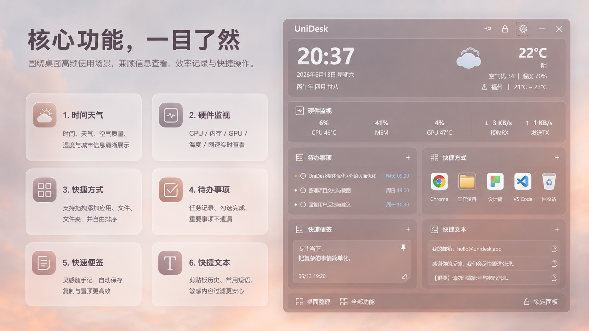
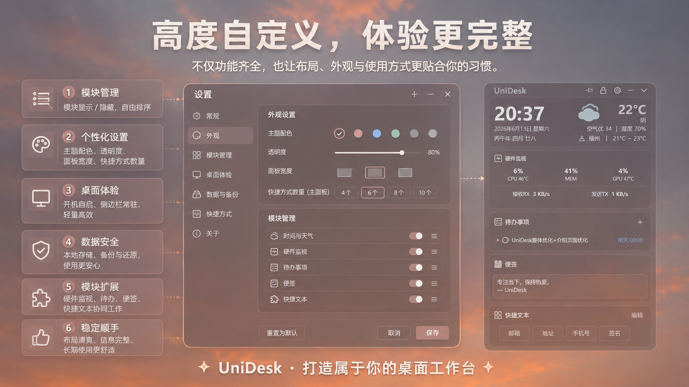

# UniDesk

UniDesk 是一个轻量、个性化、清爽好用的 Windows 桌面侧边栏工具，把时间天气、硬件监视、快捷方式、待办事项、快速便签和快捷文本整合进一个顺手的桌面工作台。


## ✨ 主要特性

### 时间天气

- 显示当前时间、日期和农历信息。
- 显示天气、温度、空气质量、湿度和城市信息。
- 内置桌面日历，方便快速查看公历和农历日期。

### 硬件监视

- 实时查看 CPU、内存、GPU 使用率。
- 显示 CPU / GPU 温度。
- 显示整机网络上传 / 下载速度。
- GPU 温度会尽量从可用驱动和硬件监视来源读取；无法读取时会安全显示为 `--`。

### 快捷方式

- 支持添加常用应用、文件和文件夹。
- 支持从桌面或资源管理器拖拽添加。
- 支持快捷方式自由排序。
- 支持自定义主面板快捷方式显示数量。

### 待办事项

- 支持新增、编辑、完成和删除待办。
- 支持任务时间和优先级显示。
- 数据本地保存，适合日常事项记录。

### 快速便签

- 支持多条便签。
- 支持自动保存、置顶、复制和删除。
- 适合临时记录灵感、草稿、会议记录和备忘内容。

### 快捷文本

- 支持剪贴板历史。
- 支持常用短语。
- 支持一键复制。
- 支持敏感内容过滤，尽量避免保存验证码、密码、Token、Cookie 等敏感文本。

### 模块管理

- 支持模块显示 / 隐藏。
- 支持模块自由排序。
- 可以按自己的使用习惯组合桌面面板。

### 个性化设置

- 支持主题配色、窗口透明度、面板宽度、面板高度和字体大小调节。
- 支持自定义顶部显示名称。
- 支持置顶、锁定、收起、开机自启和快捷方式数量设置。
- 支持恢复默认布局和恢复默认设置。

### 数据备份与还原

- 支持本地数据备份。
- 支持待办事项、快速便签、剪贴板历史和常用短语还原。
- 方便重装系统或迁移电脑后恢复常用数据。

## 🖼️ 界面预览

### 核心功能



### 个性化设置



## 🚀 适合谁使用

UniDesk 适合希望桌面保持清爽，但又想快速查看信息、打开常用工具、记录待办和便签的 Windows 用户。

适合场景：

- 日常办公
- 个人效率管理
- 桌面快捷启动
- 系统状态查看
- 轻量待办与便签记录
- 常用文本快速复制

## 📦 安装与使用

从 [GitHub Releases](https://github.com/SuperDaddyV/UniDesk/releases/latest) 下载最新安装包并运行。

当前正式安装包示例：

```powershell
UniDesk_Setup_1.3.2.exe
```

建议安装或升级前先退出正在运行的 UniDesk。

系统要求：

- Windows 10 1903 或更新版本
- Windows 11

## 🛠️ 本地构建

环境要求：

- .NET 9 SDK
- Windows 10 1903 或更新版本
- Visual Studio 2022、JetBrains Rider，或其他支持 .NET / WPF 的开发环境
- Inno Setup 6，仅制作安装包时需要

构建并运行：

```powershell
git clone https://github.com/SuperDaddyV/UniDesk.git
cd UniDesk

dotnet restore UniDesk.sln
dotnet build UniDesk.sln -c Release
dotnet run --project UniDesk\UniDesk.csproj
```

发布应用：

```powershell
dotnet publish .\UniDesk\UniDesk.csproj -c Release -r win-x64 --self-contained true -p:PublishSingleFile=false -o publish\win-x64
```

制作安装包：

```powershell
ISCC.exe .\UniDesk.iss
```

安装包会输出到 `installer` 目录。

## 🧰 技术栈

| 技术 | 用途 |
| --- | --- |
| .NET 9 | 应用运行框架 |
| WPF | Windows 桌面界面 |
| SQLite | 本地数据存储 |
| CommunityToolkit.Mvvm | 界面与数据绑定辅助 |
| LibreHardwareMonitorLib | 硬件信息读取 |
| Hardcodet.NotifyIcon.Wpf | 系统托盘 |
| Inno Setup | Windows 安装包 |

## 🔐 数据与隐私

UniDesk 优先使用本地存储，用户数据保存在本机。当前主要数据包括设置、快捷方式、待办事项、快速便签、快捷文本和图标缓存等。

剪贴板历史功能带有敏感内容过滤，用于尽量避免保存验证码、密码、Token、Cookie 等敏感文本。该过滤用于降低误存风险，但不应被视为绝对安全保证；如果处理高敏感内容，建议关闭剪贴板历史或及时清理记录。

## 🆕 更新亮点

当前版本已补充以下能力：

- 新增模块管理：支持模块显示 / 隐藏和排序。
- 新增快捷方式拖拽添加与自由排序。
- 新增快速便签：支持多条便签、自动保存、置顶和复制。
- 新增快捷文本：支持剪贴板历史、常用短语和敏感内容过滤。
- 优化硬件监视布局，完整显示 CPU、内存、GPU、温度和 RX / TX 网速。
- 优化 GPU 温度读取，尽量兼容更多硬件与驱动环境。
- 优化个性化设置和主面板滚动体验。

## 📌 后续计划

- 更多主题预设。
- 更完善的硬件详情展示。
- 更灵活的模块扩展能力。
- 更好的安装与更新体验。

## 🙏 致谢

UniDesk 基于 [Happyeveryweek/LumiDesk](https://github.com/Happyeveryweek/LumiDesk) 开发。感谢原作者提供的创意、基础代码和桌面小工具体验。

## 📄 License

本项目遵循仓库中的 [MIT License](LICENSE)。请同时尊重原项目和第三方依赖的许可证与版权声明。
