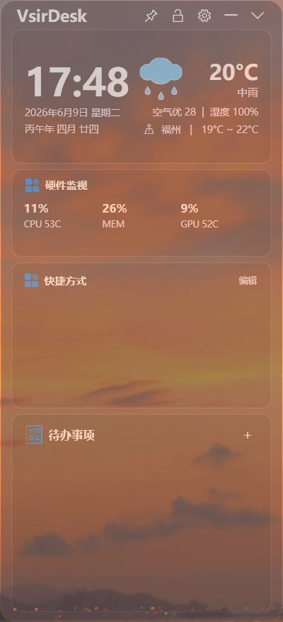
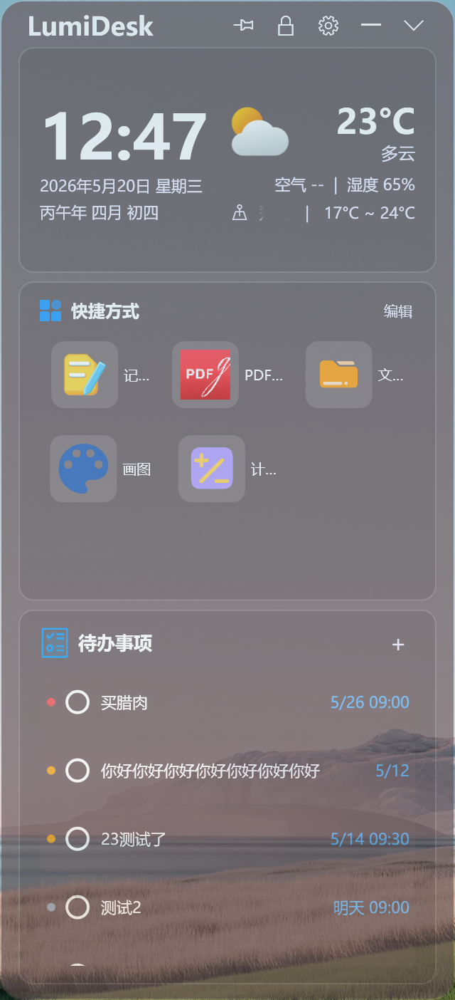
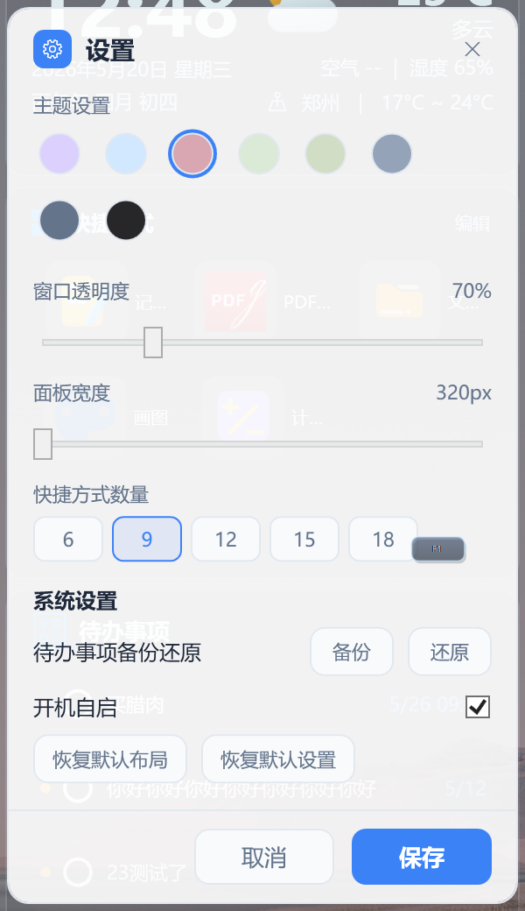
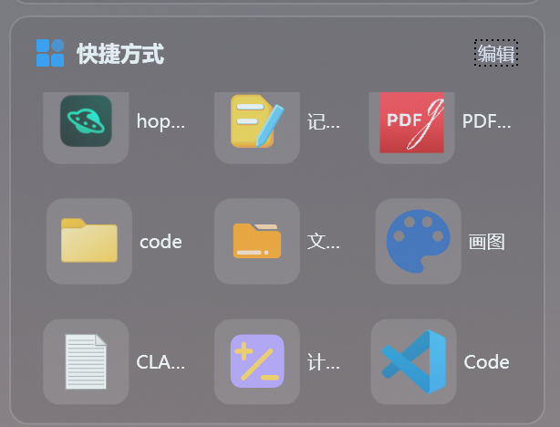
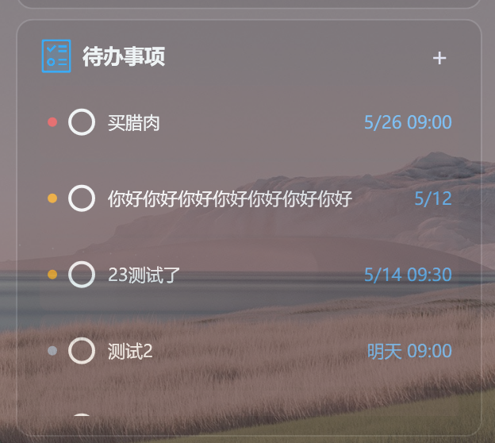

# VsirDesk

<p align="center">
  
</p>

<p align="center">
  <b>Windows 桌面侧边小工具</b><br>
  时间天气、硬件监视、快捷方式、待办事项和个性化面板集中在一个轻量桌面栏里。
</p>

<p align="center">
  <a href="#功能亮点">功能亮点</a> ·
  <a href="#截图">截图</a> ·
  <a href="#安装">安装</a> ·
  <a href="#构建">构建</a>
</p>

---

## 简介

VsirDesk 是基于 LumiDesk 改造的 Windows 桌面侧边工具。它可以贴在桌面边缘，常驻显示常用信息，并支持收起、置顶、调整透明度和面板宽度。

本版本新增了内置硬件监视模块，直接集成在主面板中，位于“天气时间”和“快捷方式”之间。它不是单独悬浮窗，因此可以跟随 VsirDesk 的主题、透明度、宽度和面板设置统一管理。

## 功能亮点

- **时间天气**：显示当前时间、日期、农历、天气、空气质量、湿度和温度范围。
- **硬件监视**：显示 CPU 使用率和温度、内存使用率、GPU 使用率和温度。
- **快捷方式**：把常用应用、文件夹或文件放到桌面侧边栏，一键打开。
- **待办事项**：记录待办，支持优先级、到期日期、完成状态和备份还原。
- **面板设置**：支持窗口置顶、锁定、透明度、宽度、主题颜色、开机自启和收起展开。
- **本地存储**：主要数据保存在本地，不依赖云端同步。

## 截图

### 主界面和硬件监视

<p align="center">
  
</p>

### 更多界面

<p align="center">
  
  
</p>

<p align="center">
  
  
</p>

## 硬件监视说明

硬件监视模块会尽量从系统和硬件厂商组件读取数据：

- CPU 使用率来自 Windows 性能计数。
- 内存使用率来自 Windows 系统内存状态。
- CPU 温度优先读取 Armoury Crate 相关硬件监控组件。
- AMD GPU 使用率和温度优先读取 AMD 显卡驱动提供的数据。

不同电脑的驱动、主板工具和权限状态不同，个别温度项可能显示为 `--`。只要相关厂商组件可用，模块会自动读取并刷新。

## 安装

在 GitHub Releases 页面下载发布包，解压后运行：

```powershell
LumiDesk.exe
```

系统要求：

- Windows 10 1903 或更新版本
- Windows 11
- .NET 9 Desktop Runtime

## 构建

```powershell
dotnet restore
dotnet build --configuration Release
dotnet publish .\LumiDesk\LumiDesk.csproj -c Release -o publish --self-contained false
```

发布后的文件会输出到 `publish` 目录。

## 说明

这是个人定制版，保留原 LumiDesk 的核心桌面小工具体验，并加入硬件监视和 VsirDesk 命名调整。
