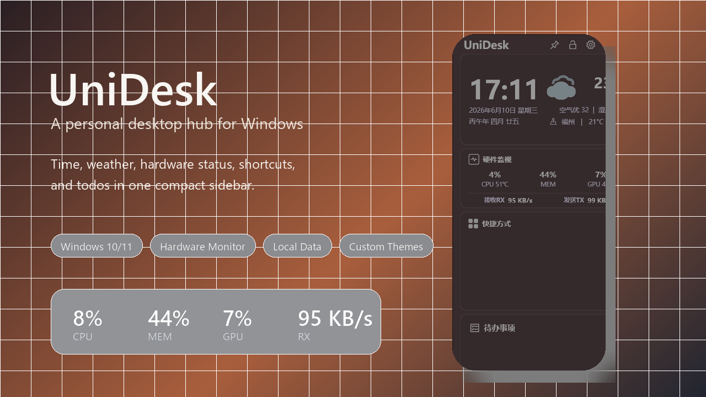
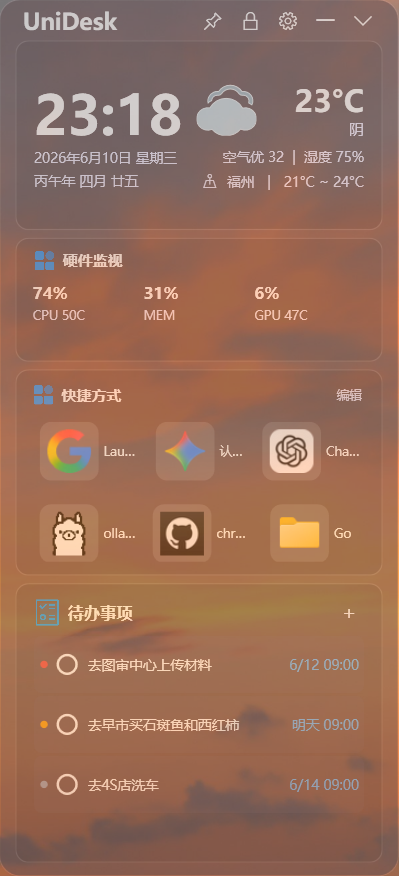
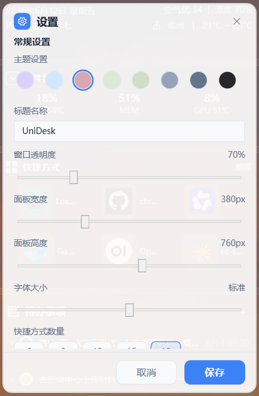
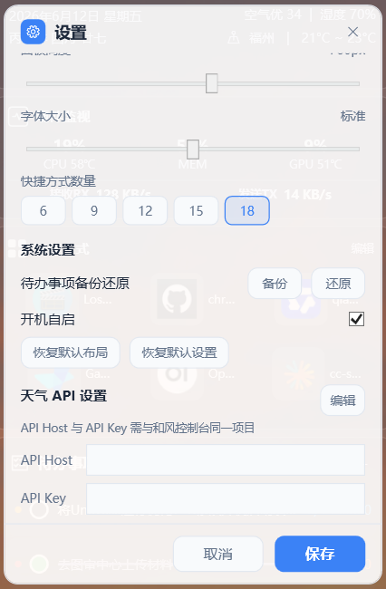
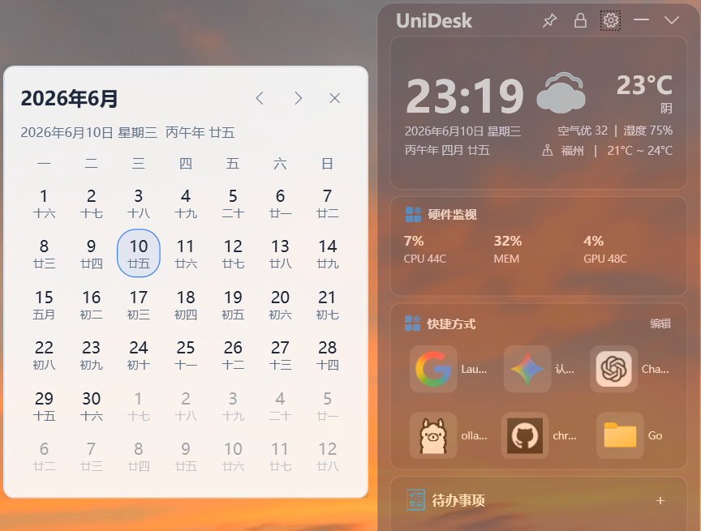

# UniDesk

<p align="center">
  
</p>

<p align="center">
  <b>轻量的 Windows 桌面侧边栏，把时间天气、硬件监视、快捷方式、待办事项和个人桌面工作流集中到一个面板里。</b>
</p>

<p align="center">
  <a href="README.md">English</a> | 简体中文
</p>

<p align="center">
  <a href="#项目介绍">项目介绍</a> ·
  <a href="#原项目致谢">原项目致谢</a> ·
  <a href="#功能亮点">功能亮点</a> ·
  <a href="#界面截图">界面截图</a> ·
  <a href="#安装使用">安装使用</a> ·
  <a href="#开发构建">开发构建</a>
</p>

## 项目介绍

UniDesk 是一个紧凑的 Windows 桌面侧边工具。它可以贴在桌面边缘，常驻显示时间、天气、快捷入口、待办事项和轻量硬件状态。

它的目标不是做一个复杂的桌面管理器，而是提供一个安静、顺手、可长期使用的个人桌面中心：需要时一直可见，不需要时可以收起，也能根据屏幕尺寸和个人偏好调整显示效果。

## 原项目致谢

UniDesk 基于 [Happyeveryweek/LumiDesk](https://github.com/Happyeveryweek/LumiDesk) 开发。感谢原作者提供的创意、基础代码和桌面小工具体验。

本项目在 LumiDesk 的基础上进行了品牌重命名、硬件监视集成、实时网速显示、布局优化、面板个性化、双语说明文档和安装包发布等扩展。

## 功能亮点

- **时间天气**：显示当前时间、日期、农历、天气、湿度、空气质量和温度范围。
- **硬件监视**：显示 CPU、内存、GPU、温度，以及实时网络接收/发送速度。
- **快捷方式**：把常用应用、文件夹或文件固定到侧边栏，一键打开。
- **待办事项**：记录待办任务，支持优先级、到期时间、完成状态、备份和还原。
- **内置日历**：打开桌面日历面板，查看公历和农历日期。
- **个性化面板**：支持显示标题、主题颜色、透明度、宽度、高度、字体大小、置顶、锁定、收起和快捷方式数量设置。
- **天气 API 设置**：可以在设置里配置天气 API Host 和 API Key。
- **本地优先**：设置、快捷方式和待办事项主要保存在本地。

## 界面截图

### 主界面

<p align="center">
  
</p>

### 个性化设置

<p align="center">
  
</p>

### 系统与天气 API 设置

<p align="center">
  
</p>

### 内置日历

<p align="center">
  
</p>

## 硬件监视

硬件监视模块直接集成在 UniDesk 主面板中，位于天气和快捷方式之间。它不是独立悬浮窗，因此会跟随主面板的主题、透明度、宽度和窗口设置统一变化。

不同电脑能读取到的数据会受到硬件、驱动和权限影响：

- CPU 使用率来自 Windows 系统计数。
- 内存使用率来自 Windows 系统内存状态。
- CPU 温度会尽量从可用的硬件监视来源读取。
- AMD GPU 使用率和温度会尽量从驱动或厂商数据读取。
- 网络速度会统计可用的有线网卡和 Wi-Fi 网卡，并显示实时接收/发送速度。

如果某些温度数据无法读取，界面会显示 `--`。

## 定位说明

自动定位使用当前网络出口 IP。普通家庭网络下通常能识别到正确城市，但代理、VPN、公司网络、运营商出口等情况可能导致定位到其他城市。需要固定城市时，可以在设置里手动选择。

## 安装使用

从 [GitHub Releases](https://github.com/SuperDaddyV/UniDesk/releases/latest) 下载最新安装包并运行：

```powershell
UniDesk_Setup_1.2.0.exe
```

系统要求：

- Windows 10 1903 或更新版本
- Windows 11

## 开发构建

### 环境准备

- Visual Studio 2022 或 JetBrains Rider
- .NET 9 SDK
- Windows 10 v1903+ 或 Windows 11
- Inno Setup 6，仅打包安装程序时需要

### 克隆与运行

```powershell
git clone https://github.com/SuperDaddyV/UniDesk.git
cd UniDesk

dotnet restore
dotnet build --configuration Release
dotnet run --project UniDesk
```

### 发布应用

```powershell
dotnet publish .\UniDesk\UniDesk.csproj -c Release -r win-x64 --self-contained true -p:PublishSingleFile=false -o publish\win-x64
```

### 制作安装包

```powershell
ISCC.exe .\UniDesk.iss
```

安装包会输出到 `installer` 目录。

## 技术栈

| 技术 | 用途 |
| --- | --- |
| .NET 9 | 运行时与基础框架 |
| WPF | Windows 桌面界面 |
| Wpf.Ui | Windows 11 风格控件 |
| CommunityToolkit.Mvvm | MVVM 辅助工具 |
| Microsoft.Data.Sqlite | 本地数据存储 |
| Hardcodet.NotifyIcon.Wpf | 系统托盘图标 |
| Inno Setup | Windows 安装包 |

## 项目结构

```text
UniDesk/
├─ UniDesk/                # 主程序
│  ├─ Controls/            # 自定义控件
│  ├─ Helpers/             # 工具类
│  ├─ Models/              # 数据模型
│  ├─ Services/            # 业务服务
│  ├─ ViewModels/          # MVVM 视图模型
│  ├─ Resources/           # 主题和资源
│  └─ icon/                # 应用图标与内置资源
├─ UniDesk.Tests/          # 单元测试
├─ docs/                   # 文档
├─ images/                 # README 图片
├─ installer-assets/       # 安装包语言资源
├─ installer/              # 安装包输出目录
├─ UniDesk.iss             # 安装包脚本
└─ README.md
```

## 配置与数据

UniDesk 的新数据目录为 `%LOCALAPPDATA%\UniDesk`。启动时会尝试复制兼容的旧版本地数据，尽量保留原有设置、待办事项、快捷方式、主题配置和缓存文件。

常见数据包括：

```text
%LOCALAPPDATA%\UniDesk\
├─ UniDesk.db              # 本地数据库
├─ weather_cache.json      # 天气缓存
├─ icons\                  # 快捷方式图标缓存
└─ logs\                   # 运行日志
```

## 许可证

本项目遵循仓库中的许可证。请同时尊重原项目 [LumiDesk](https://github.com/Happyeveryweek/LumiDesk) 及第三方依赖的许可证和版权声明。
