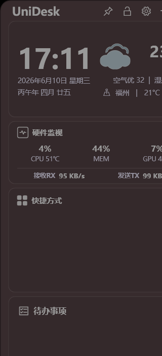

# UniDesk Release Notes

## Highlights

- Renamed the desktop widget project to UniDesk.
- Integrated the hardware monitor into the main panel.
- Added CPU, memory, GPU, temperature, and network speed display.
- Kept the hardware monitor under the same theme, transparency, and panel width settings as other modules.
- Preserved local user data by migrating compatible legacy data into the UniDesk data directory.

## Run

After extracting the release package, run:

```powershell
UniDesk.exe
```

If the app does not start, install the .NET 9 Desktop Runtime first.

## Screenshot


